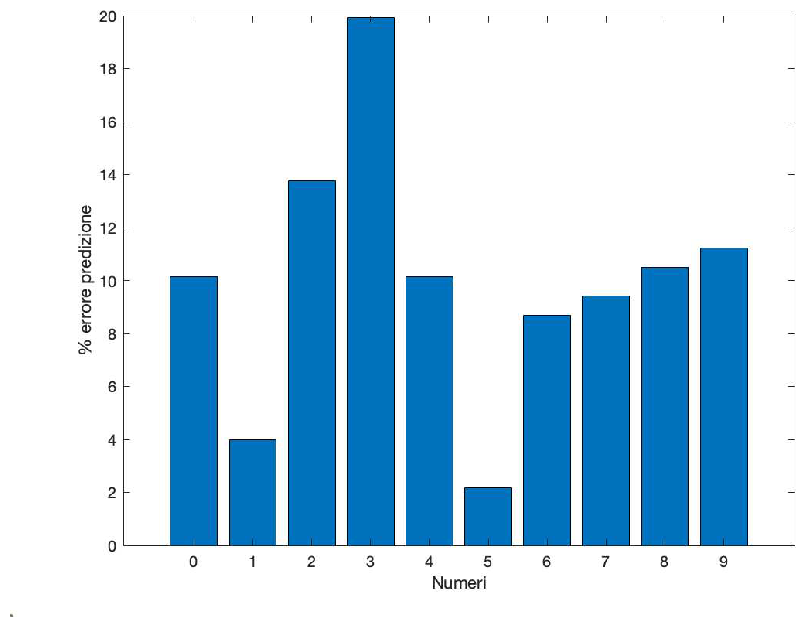
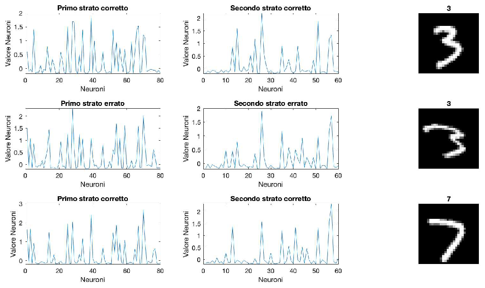
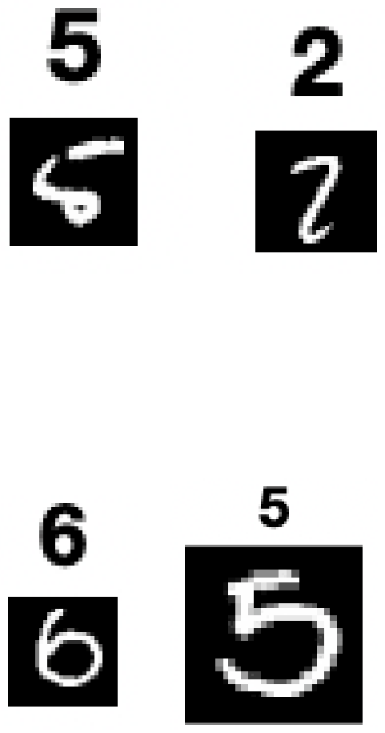

# MNIST Digit Classification with MLP (MATLAB)

Autore: **Antonio Ferri**  

Questo repository contiene un progetto di **Machine Learning** per la classificazione delle cifre MNIST (`0-9`) con una rete neurale feed-forward in MATLAB, insieme a un'analisi qualitativa e quantitativa degli errori.

## Contenuto del progetto

- training della rete su dataset MNIST,
- test su set separato,
- analisi delle misclassificazioni,
- osservazione del comportamento degli strati nascosti,
- discussione dei limiti e possibili miglioramenti.

## Obiettivo dell'Esercizio 2

Far riconoscere a una macchina cifre scritte a mano, rappresentate come immagini in scala di grigio `28x28`, usando un **Multi Layer Perceptron (MLP)** con due hidden layer.

## Dataset e formato

Nel progetto i dati sono organizzati con la convenzione:

- prima colonna: etichetta corretta (digit `0..9`),
- colonne successive: pixel dell'immagine (784 valori),
- immagini normalizzate in `[0,1]` prima del passaggio in rete.

File principali dei dati:

- `data_train.mat` -> training set
- `data_test.mat` -> test set

## Architettura della rete

La rete usata nel training è:

- input layer: `784` feature
- hidden layer 1: `80` neuroni
- hidden layer 2: `60` neuroni
- output layer: `10` neuroni (una classe per cifra)

Learning rate usato negli esperimenti: `0.0058`.

### Inizializzazione

- `w12 = randn(80,784) * sqrt(2/784)`
- `w23 = randn(60,80) * sqrt(2/80)`
- `w34 = randn(10,60) * sqrt(2/60)`
- bias inizializzati random (`b12`, `b23`, `b34`)

## Pipeline algoritmica

Per ogni epoca di training:

1. **Feed-Forward**
2. **Back-Propagation**
3. **Gradient Descent** su pesi e bias
4. Shuffle dei campioni per l'epoca successiva

L'addestramento è eseguito su **50 epoche**.

## Risultati ottenuti

Su 10.000 immagini di test:

- corrette: **9724**
- errate: **276**
- errore: **2.76%**

Il testo evidenzia che:

- una parte degli errori è dovuta ad ambiguità visiva (anche per un umano),
- altre misclassificazioni avvengono su cifre apparentemente ben leggibili.

## Analisi degli errori

Dalla distribuzione degli errori sulle 276 immagini non predette:

- la cifra **3** è la classe più critica,
- classi come **1** e **5** risultano meno problematiche,
- possibile direzione migliorativa: aumentare esempi di training per classi più difficili (es. cifra 3).

## Figure

### 1) Error analysis chart



### 2) Internal layer comparison chart



### 3) Final result/summary visualization



## Struttura file

Script MATLAB:

- `digit_train.m` -> training della rete
- `digit_test.m` -> inferenza e accuratezza
- `elu.m` -> funzione di attivazione
- `elup.m` -> derivata della funzione di attivazione
- `shuffle.m` -> mescolamento campioni

Parametri salvati:

- pesi: `wtwo.mat`, `wthree.mat`, `wfour.mat`
- bias: `btwo.mat`, `bthree.mat`, `bfour.mat`

## Come eseguire

Aprire MATLAB nella cartella del progetto.

### Training

```matlab
run('digit_train.m')
```

Output atteso:

- stampa epoche,
- salvataggio pesi/bias nei file `.mat`.

### Test

```matlab
run('digit_test.m')
```

Output atteso:

- stampa accuratezza percentuale sul test set.

## Interpretazione dei risultati

Il progetto dimostra una pipeline completa di classificazione su MNIST con accuratezza elevata, ma anche con margini di miglioramento rispetto a modelli più moderni (es. CNN).

## Limiti

- approccio MLP classico, non convoluzionale,
- sensibilità ad alcune cifre simili (in particolare classe 3),
- assenza di data augmentation e tecniche avanzate di ottimizzazione.

## Possibili miglioramenti futuri

- passaggio a CNN,
- data augmentation,
- tuning più spinto di iperparametri,
- loss/attivazione di output più standard per classificazione multiclasse,
- analisi confusion matrix per classe.

## Nota finale

Questo README descrive in modo autonomo il progetto e i risultati principali.
